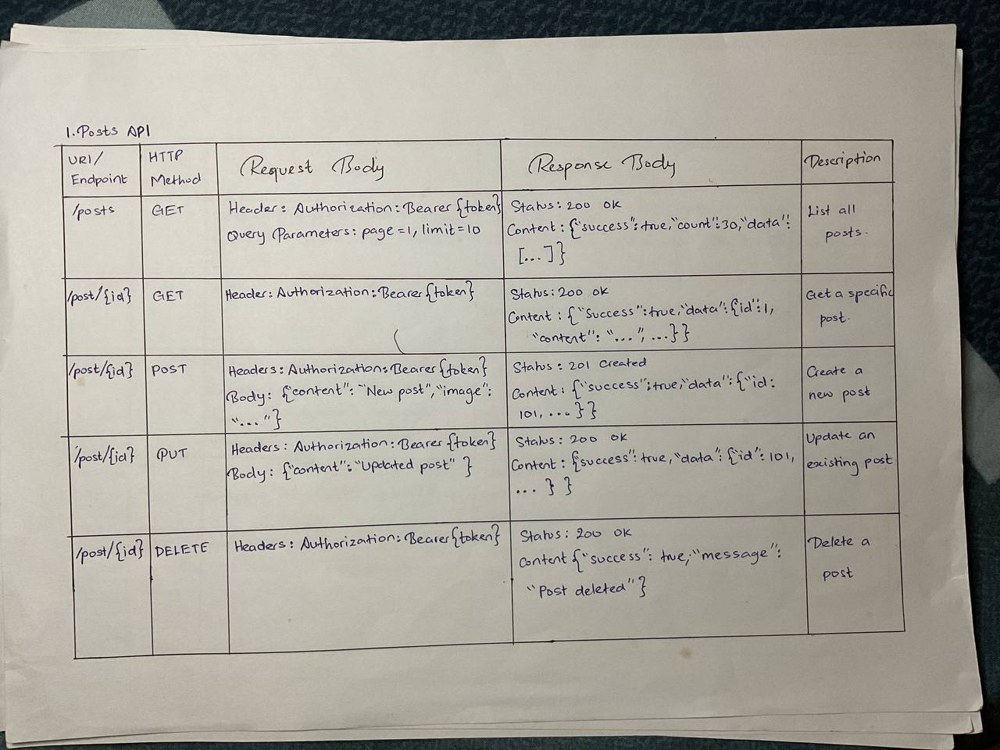

# Social Media API Design Practical

This project demonstrates the design and implementation of RESTful API endpoints for a social media platform, similar to Instagram. It covers resources such as Posts, Users, Comments, Likes, and Followers, following best practices for URI design, HTTP methods, and content negotiation.

## Features

- RESTful endpoints for all major resources (Posts, Users, Comments, Likes, Followers)
- Supports CRUD operations: list, get, create, update, delete
- Pagination for listing endpoints
- Content negotiation (JSON and XML responses)
- Proper HTTP status codes and error handling
- Example API documentation in `public/docs.html`
- Mock data for demonstration and testing

## Technologies Used

- Node.js
- Express.js
- Custom middleware for content negotiation and response formatting

## Getting Started

### Prerequisites

- Node.js (v14 or higher)
- npm

### Installation

1. Clone the repository or copy the project files.
2. Install dependencies:

   ```bash
   npm install
   ```

3. Start the server:

   ```bash
   npm start
   ```

   The server will run on `http://localhost:8000` by default.

4. Open `public/docs.html` in your browser to view the API documentation.

## API Usage

- Use tools like Postman or curl to interact with the API endpoints.
- Endpoints support both JSON and XML responses (set the `Accept` header to `application/json` or `application/xml`).
- See `public/docs.html` for detailed endpoint documentation and example requests/responses.

## Screenshots




## License

This project is for educational purposes.
